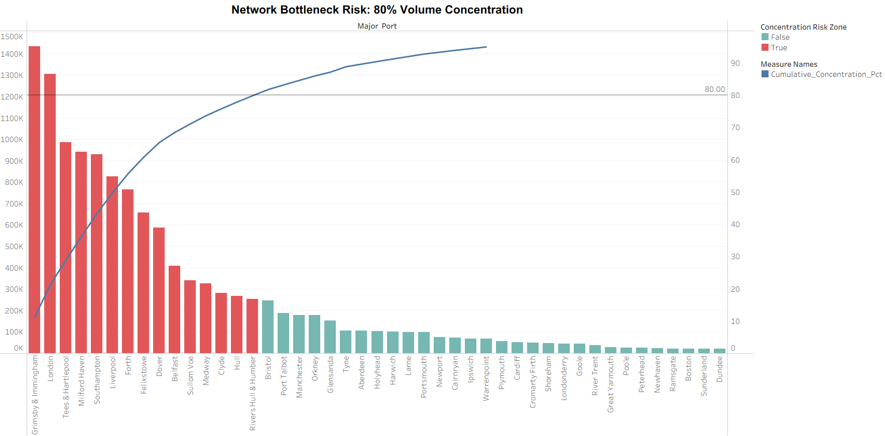

# UK Freight Ports: Strategic Growth & Bottleneck Analysis

## 📌 The Business Problem
The UK logistics network relies heavily on a centralized core of infrastructure hubs. The objective of this project is to provide the Operations Manager and executive team with clear visibility into international trade route dependencies, infrastructure bottlenecks, and single-point-of-failure risks within the national supply chain. 

## 🛠️ Tools & Techniques
*   **Tableau:** Interactive Executive Dashboards, Level of Detail (LOD) Expressions, Dynamic Sets, Dual-Axis Pareto Charts, Parameter Actions.
*   **SQL (Data Transformation):** Common Table Expressions (CTEs), Window Functions (`OVER()`, `RANK()`), and conditional aggregations (`CASE WHEN`) to validate Tableau calculations and map cumulative network risk.
*   **Business Intelligence:** Pareto 80/20 Analysis, Year-over-Year (YoY) Growth Metrics, and Supply Chain Risk Modeling.

## 🚀 Key Insights & Executive Recommendations
1.  **Severe Infrastructure Bottlenecking:** Grimsby & Immingham and London alone process over 21% of national tonnage. 
    *   **Recommendation:** Diversify capital investment into tier-2 ports like Milford Haven to spread operational risk.
2.  **Shifting Trade Lanes:** Established European hub growth is stagnating, while emerging markets (e.g., Côte d'Ivoire at 21.4% CAGR) present rapid expansion opportunities. 
    *   **Recommendation:** Realign dedicated infrastructure and container capacity to support high-growth trade corridors.
3.  **The 80/20 Risk:** The Top 10 ports control 80.8% of the entire nation's freight volume, creating a highly fragile network dependency.

## 📁 Repository Structure
*   `/data`: Contains the sample dataset used for the analysis (or a link to the data source).
*   `/sql_queries`: 
    *   `00_exploratory_data_analysis.sql`: Foundational data profiling, including top trading partners, basic aggregations, and container utilization KPIs.
    *   `01_international_route_exposure.sql`: Calculates the international vs. domestic freight ratio per port.
    *   `02_pareto_bottleneck_risk.sql`: Calculates the cumulative running sum of tonnage to map the 80/20 network capacity risk.
    *   `03_top_10_port_share_kpi.sql`: Aggregates the absolute market share of the top 10 UK ports combined.
    *   `04_yoy_network_resilience.sql`: Uses `LAG()` window functions to calculate Year-over-Year (YoY) tonnage and TEU fluctuations.
    *   `05_primary_cargo_by_port.sql`: Uses `PARTITION BY` window functions to isolate the top specialized cargo group per port.
*   `/assets`: High-resolution dashboard screenshots.

## 🔗 Live Dashboard
Explore the fully interactive dashboard on **[Tableau Public](Insert-Your-Tableau-Public-Link-Here)**.

## ⏭️ Limitations & Next Steps
*   **Data Limitation:** The current dataset aggregates 2025 volume but does not account for seasonal or monthly volatility spikes. 
*   **Next Steps:** Incorporate quarterly historical data to map seasonal container congestion at Felixstowe versus bulk congestion at Grimsby, allowing for predictive capacity planning.
